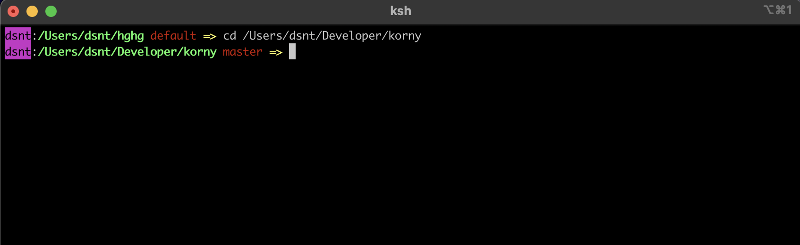
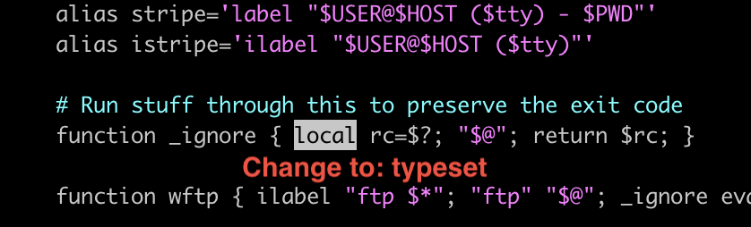
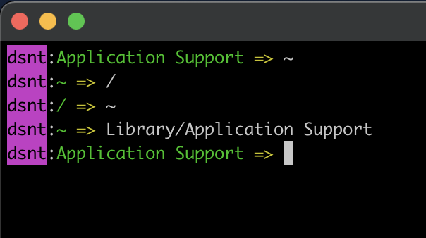
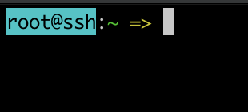
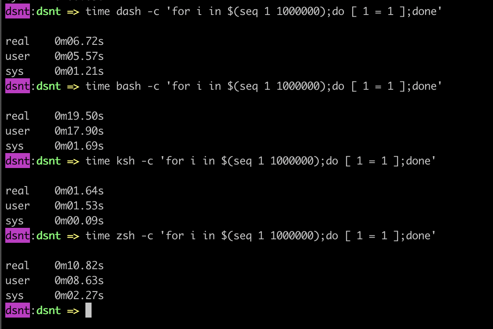

# korny

Something like plugin for kornshell

## Requirements

* git (avoid apple crappy one, use brew's or nix's)
* ksh93 ([Best option](https://github.com/ksh93/ksh), pdksh or mksh won't work).

## Tested OSes
* macOS
* SunOS
* FreeBSD and OpenBSD
* Should also work for linux
## Installation

Original Kornshell is buggy, you can compile one above or use precompiled versions in [releases](https://github.com/DesantBucie/korny/releases)

Change default shell to kornshell:

`which ksh` - output will be path to ksh

Make sure that ksh is in `/etc/shells` (it can be named ksh93), if there isn't, enter a path;

`chsh -s <PATH TO KSH>`

Run: `ksh -c "$(curl -fsSL https://raw.githubusercontent.com/DesantBucie/korny/master/bin/install.ksh)"`

### OpenBSD
 
In OpenBSD you have to change `local` to `typeset` in /etc/ksh.kshrc, use vim or any other editor, and just search.

You also need to set `export ENV=$HOME/.kshrc` in ~/.profile or /etc/profile

### FreeBSD

Set `export ENV=$HOME/.kshrc` in ~/.profile or /etc/profile

## Update

Type: `korny_update`

## Uninstall

Type: `korny_uninstall`

## About

If you only used ohmyzsh for theme and aliases, like I did, then you
probably find this similar and maybe faster. 

I integrated my basic theme with git. If you access via ssh, you will get different color.

## Why should I use it instead of zsh?

I think in most situations it's going to be quicker. For example look at that times i measured.

And it's definetly quicker than bash, and you shouldn't see many differences in terms of everyday using.
